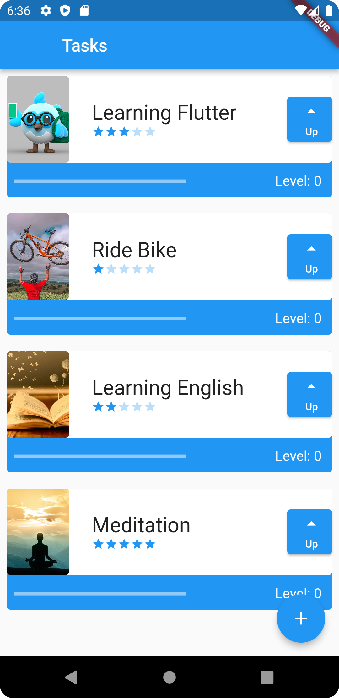
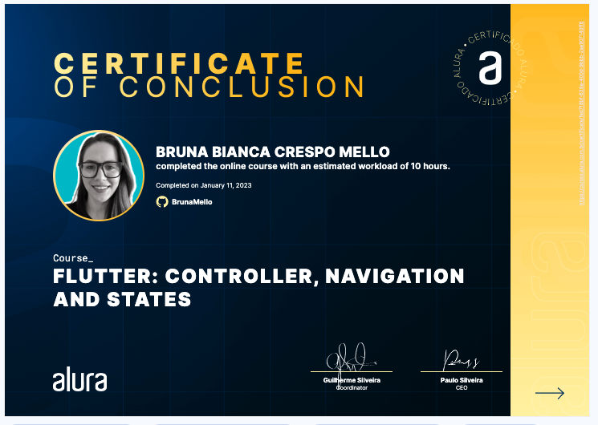

<h1>Flutter: Controller, Navigation and States</h1>

Take this Flutter course and:

- Learn how to create forms that collect user information
- Validate information in forms and store it with the Controller
- Navigate between different screens in one app
- Understand navigation and routing concepts
- Find out what state is in Flutter and apply this concept
- Dive into the world of Context and its applications
- Explore the Inherited Widget, capable of handling information between Widgets

Screenshot app:

Certificate: 'https://cursos.alura.com.br/certificate/fed718bf-639a-400d-9bbb-2aa907140ff6'

